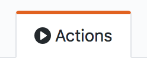
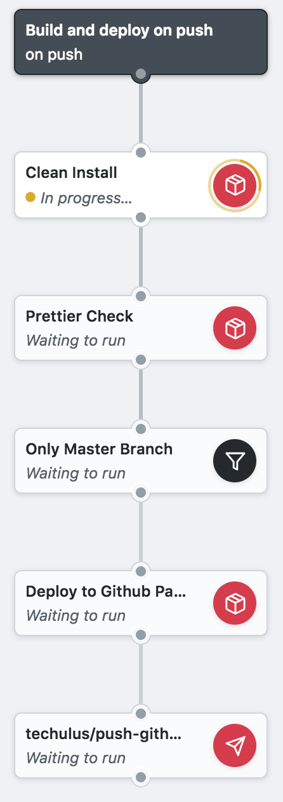
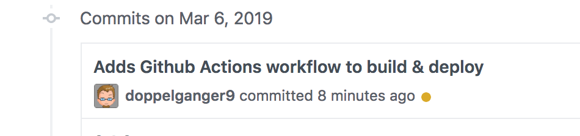
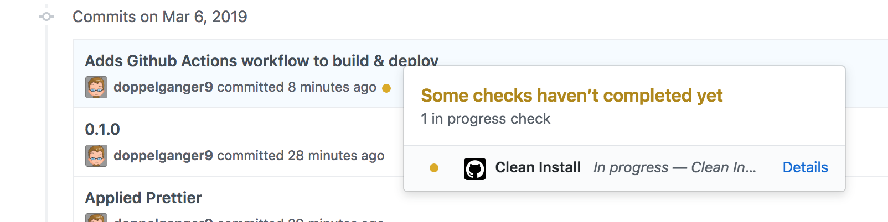
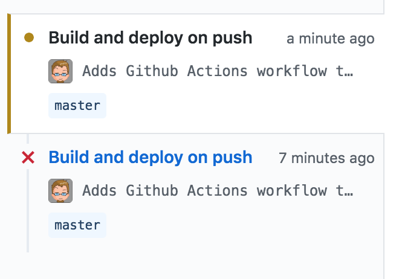
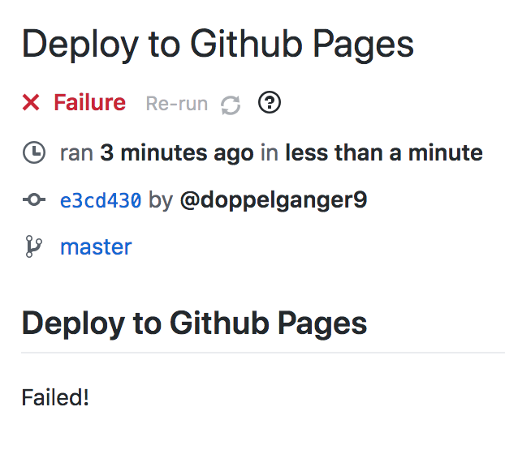
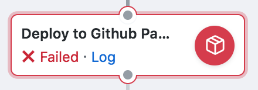
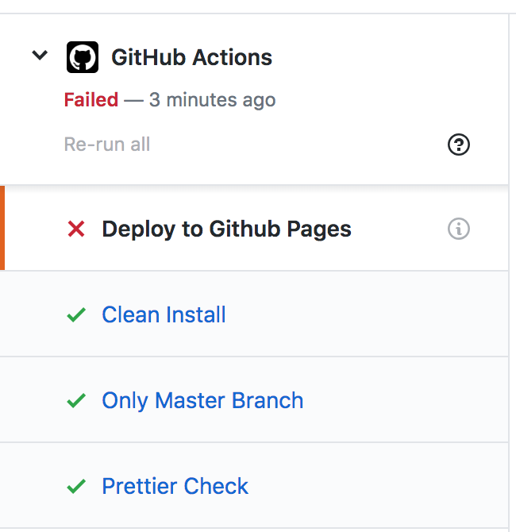
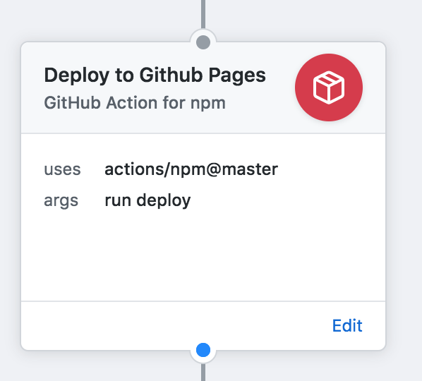
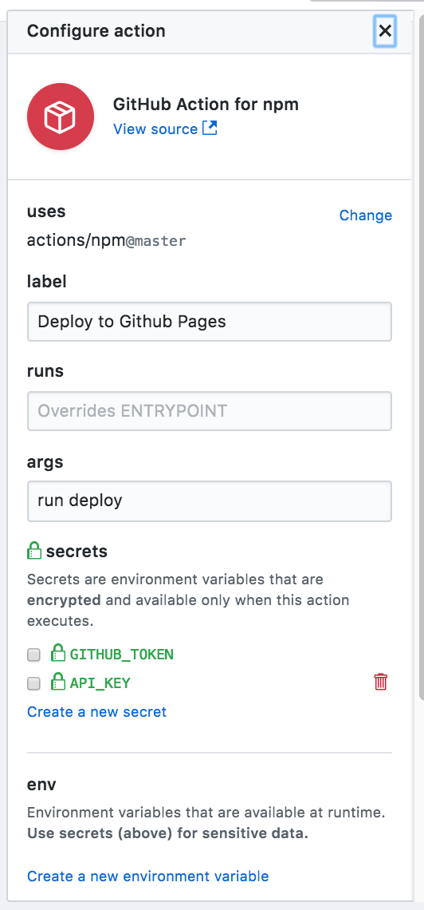

My intent for this blog is for it to be fully **Open Source**.

You can check all the commits [on the Github Repository](https://github.com/doppelganger9/blog).

It is built with [GatsbyJS](https://www.gatsbyjs.org/) and ⚛️**React**.

## Automation

I'm a big fan of automation. So it's natural that one of the first steps of setting up this blog for me was to make it automatically build & deploy.
> (Instead of writing content, right. I know. Procrastinating on tools)

So today I pushed a few commits to set up a **CI/CD** pipeline.

> CI = Continuous Integration
>
> CD = Continuous Deployment

I mean, a *Github Actions workflow*, as it is properly called.

## Github Actions?

They are Github's take on CI/CD.
> What's different from GitLab CI/CD, or Jenkins, or Travis CI and the likes?

- a lot of triggers (pushing code, creating wiki, creating issue, posting a comment, or anything imaginable with webhooks)
- each step is a microservice, a docker image run with [some specific specs](https://developer.github.com/actions/creating-github-actions/accessing-the-runtime-environment/#runtime-environment-resources)
- there is a nice visual editor that renders a graph based on a textual representation
- it's currently in limited public beta, you have to request access.
- there is a marketplace for actions, and you can easily create and publish yours.

Have a look here : https://github.com/features/actions

Also the documentation: https://developer.github.com/actions/


## Github Actions Workflow

Now let's take a tour of what I've done so far.

In the [Github Repository for this blog](https://github.com/doppelganger9/blog), click on the Actions Tab : 

You will see the `main.workflow` file beautifully rendered as a graph presenting the initial trigger, each step, and how they are linked, their name, and the execution status:



This is the raw file in all its textual splendor (not YAML or JSON, more like Terraform):

```
workflow "Build and deploy on push" {
  on = "push"
  resolves = [
    "Only Master Branch",
    "techulus/push-github-action@master",
  ]
}

action "Clean Install" {
  uses = "actions/npm@master"
  args = "ci"
}

action "Prettier Check" {
  uses = "actions/npm@master"
  args = "run format -- --check"
  needs = ["Clean Install"]
}

action "Deploy to Github Pages" {
  uses = "actions/npm@master"
  needs = ["Only Master Branch"]
  args = "run deploy"
}

action "Only Master Branch" {
  uses = "actions/bin/filter@master"
  needs = ["Prettier Check"]
  args = "branch master"
}

action "techulus/push-github-action@master" {
  uses = "techulus/push-github-action@master"
  needs = ["Deploy to Github Pages"]
  secrets = ["API_KEY"]
  env = {
    MESSAGE = "https://blog.lacourt.dev/ updated by Github Actions pipeline!"
  }
}
```

Now let's see how all of this executes.

## Running it

> The Github Actions Workflows are *event-driven*. It means that there is no button "run this workflow" (yet, we're still in beta), but a trigger from a long list of about everything you can imagine happen in a GitHub Repository. For me, this is the real difference from GitLab CI/CD, or an external build like Travis CI or equivalent.

For our workflow, the trigger is set on every `Push`.
It means that when I run a `git push origin master` from my local computer, it will register the Workflow for execution.

You can actually verify this with a little orange dot on the pushed commit:


Kind of a hidden UI (*such secret! very hidden! wow details!*), clicking on the dot will open a popover with some details regarding the step currently running or waiting for execution:


Clicking on **details** it will send you to a dedicated page where you can gather more information and logs about a particular step execution in the workflow.

> For example, this looks bad as my previous execution of the workflow was red, which means, **FAILED**.


Looking at the failed workflow execution:



Scrolling down, we can see the failing step:



Clicking on the **log** link will give us the complete docker image execution logs.

On the left side, there is a panel with the list of steps:



Almost SUCCEEDED...

## Amend, Push force and Try again

Ok, so while no one was looking 👀, I made some changes to the `main.workflow` file, then `git commit --amend --no-edit` and `git push --force` it to Github.

My previous error happened because I did not put `run` in the argument when the `npm` Action executed, which ran the `npm prettier -- --check` command which of course does not exist: you need `npm run prettier -- --check`. So adding this missing `run` in Args on every npm step (except `npm ci` or `npm start` or `npm test` which do not require `run`) did the trick.

Now I can look at some green steps, but there still is a failure at the deploy step.

Looking at the **logs** of this particular step, I can see:

```
*** Please tell me who you are.

Run

  git config --global user.email "you@example.com"
  git config --global user.name "Your Name"

to set your account's default identity.
Omit --global to set the identity only in this repository.
```

How can I set git config from an action or workflow file?

## Adding Environment Variables and Secrets

So I need to somehow set `user.email` and `user.name` in `git config`.

Looking at [Git documentation](), It seems I can use ENCIRONMENT VARIABLES:

```
GIT_AUTHOR_NAME is the human-readable name in the “author” field.
GIT_AUTHOR_EMAIL is the email for the “author” field.
GIT_AUTHOR_DATE is the timestamp used for the “author” field.
GIT_COMMITTER_NAME sets the human name for the “committer” field.
GIT_COMMITTER_EMAIL is the email address for the “committer” field.
GIT_COMMITTER_DATE is used for the timestamp in the “committer” field.
```

So let's edit from Github the main.workflow:
"Actions" tab, click on "View main.workflow", click the little pen 🖊 to edit the file (you must be on a branch), scroll down and click "edit" on the step you wish to modify.



You will see this panel:



Click "create a new environment variable" and add the git ones listed above.

Save the changes.

You could also have edited the file with a text editor, here is the same changeset in textual representation:

```
action "Deploy to Github Pages" {
  uses = "actions/npm@master"
  needs = ["Only Master Branch"]
  args = "run deploy"
  env = {
    GIT_AUTHOR_NAME = "Github Action"
    GIT_COMMITTER_NAME = "Github Action"
    GIT_AUTHOR_EMAIL = "david.lacourt@gmail.com"
    GIT_COMMITTER_EMAIL = "david.lacourt@gmail.com"
  }
}
```

## Still failing: change step definition!

Even with this, the same step was still failing, so I search the marketplace and [awesome Actions list]() and found one that did exactly what I wanted: deploy to gihthub pages.

So I followed the README of https://github.com/maxheld83/ghpages, created a Personal Access Token, added it to the Secrets for the step as GH_PAT, rewired everything correctly, saved and commited this to push to master.

In the end, it kind of worked, but this Action did not put a subpath in the GitHub Pages so my blog did not load properly (images, fonts, posts pages were all 404).

## Removing GH-Page, and reconfigure all the things!

You will see that I simplified the workflow, that there is no Github Page deploy anymore, because I signed up for [Netlify](https://www.netlify.com), and reconfigured my `.dev` domain to map this.

Netlify has its own mini-CI/CD, from now on, it will automatically install & build my Gatsby blog on each push to the master branch.

I think this is a more simple solution, though it requires an integration to another service (e.g. it's not 100% Github centric).

## Conclusion

I learned a lot on the way and ended up with an auto-deploy static blog triggered by a git push of new content to the master branch.

If it was not clear, Github made a lot of documentation on all this, but I still wanted to write my own as feedback.

I hope you too learned a few things, or at least witnessed how I bump against issues and go on 🤣.

> Thanks for reading this blog, If you have any questions, please use the Github Repository's Issues to start a conversation.

👋