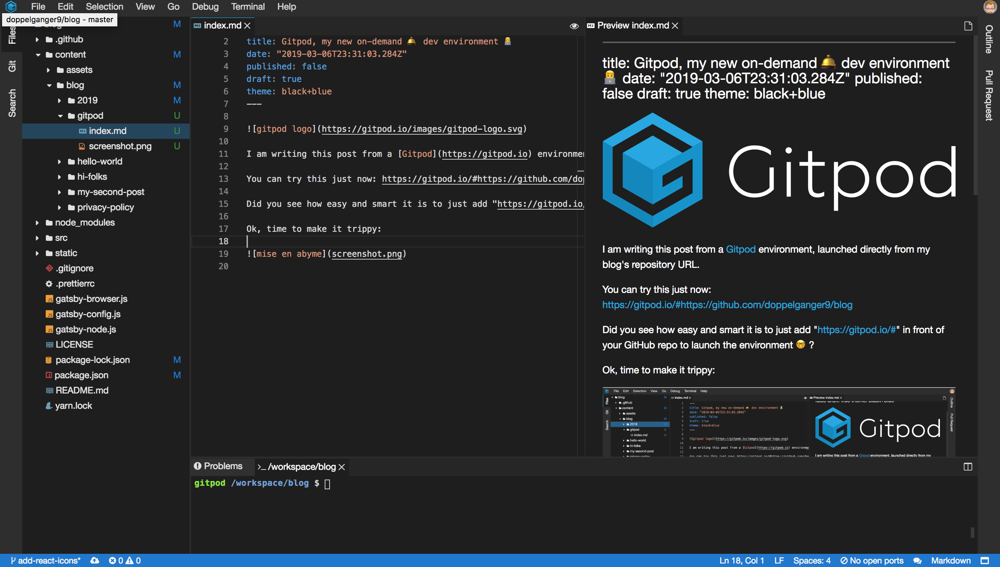

<style>
body {
    color: #fdd;
    background: #227;
    transition: color 2s, background 2s;
}
a {
    color: #ee5;
}
blockquote {
    color: #ee5;
    border-left-color: #ee5;
}
</style>


I am writing this post from a [Gitpod](https://gitpod.io) environment, launched directly from my blog's repository URL.

You can try this just now: https://gitpod.io/#https://github.com/doppelganger9/blog

Did you see how easy and smart it is to just add "https://gitpod.io/#" in front of your GitHub repo to launch the environment 🤓?

Ok, time to make it trippy:

<div style="width:50%;height:0;padding-bottom:50%;position:relative;"><iframe src="https://giphy.com/embed/rou0CTAp6Z8VW" width="100%" height="100%" style="position:absolute" frameBorder="0" class="giphy-embed" allowFullScreen></iframe></div><p><a href="https://giphy.com/gifs/hail-hypnotoad-rou0CTAp6Z8VW">via GIPHY</a></p>



## What is this?

As you see, the idea is to have a **VisualStudio Code in the browser development environment** bootstrapped from your repository.

To be more precise, it is based on [Theia IDE](https://www.theia-ide.org/)

### extensions

It does not come with your collection of VSCode Extensions, but it is enough useful for 95% of the time.

### network stability

It has a few disconnecting moments.

### exposing a local web server

It can expose ports like when you need to run your dev web server, it is possible and really frictionless.

### closing files

Whoops, If like me you are used to hitting `CMD + W` on VSCode to close files, this will not work here, because it will close the browser tab! 😱
Hopefully, opening back https://gitpod.io shows my workspaces and the one I accidentally closed is still running and I can reopen it in the state it was (process running, etc.) which is well thought!

### 💸

Don't forget to stop your workspaces, the free tier gives you 100 Hours which is really sufficient for my kind of usage: working on Github Repositories outside of working hours.

## This integration test is failing 🤭

After I finished writing the first draft of this post, I tried to `git push`, but I encountered this error:
```
 ! [remote rejected]  ... (refusing to allow an integration to create .github/main.workflow)
```

GitHub rejects my push because it seems that when you [enable Github Actions](../2019/03/06/) it blocks all other GitHub Integrations from working. And Gitpod is one such Integration.

Well... again not everything is 🌈 and 🦄.

Damn, after a little search, it seems there really is an issue about this.

https://twitter.com/stefanprodan/status/1089848015626686465

https://twitter.com/p_reynolds/status/1089880487659737088

### Partial fix and git-fu 🥋

I could not resolve myself to neither remove Github Actions nor drop using Gitpod!

So I...

- `git stash`-ed my uncommitted changes,
- `git checkout -` to leave the git branch I had dedicated for this post and come back to the previous one (`git checkout master` also works, but 5 more characters to type? Meh.)
- `git cherry-pick`-ed the commits I did, not knowing the `push` rejection issue,
- `git push` worked 🎉 from `master`, so I knew I would not have to copy all my changes out of Gitpod to my local computer,
- `git stash pop`-ped and proceeded from here to continue writing this paragraph and push it live!

## Conclusion

So, as I've experienced sort of an emotional rollercoaster,
at a moment I thought that even though I really liked the idea of having a *"remote VS Code in the browser"* and in the past had found it very useful,
combining this with Github Actions had ruined it. But pushing from `master` did the trick!

---

I hope you learned a few things or at least witnessed how I bump against issues and go on 🤣.

> Thanks for reading this blog, If you have any questions, please use the Github Repository's Issues to start a conversation.

👋