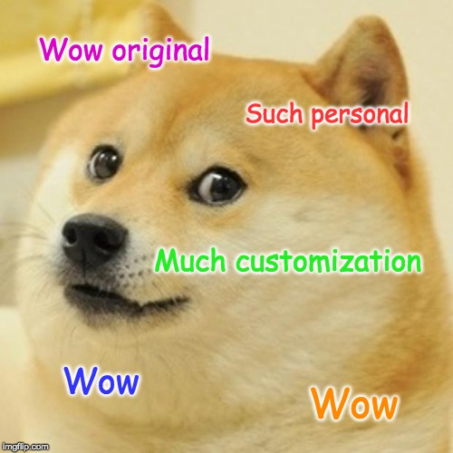

*NOTE: this should have been one of my first posts, so it's kind of a "pilot" post.*

## What is

![Gatsby](data:image/svg+xml;base64,PHN2ZyB4bWxucz0iaHR0cDovL3d3dy53My5vcmcvMjAwMC9zdmciIHZpZXdCb3g9IjAgMCAxMDYgMjgiPgogIDxwYXRoIGQ9Ik02Mi45IDEyaDIuOHYxMGgtMi44di0xLjNjLTEgMS41LTIuMyAxLjYtMy4xIDEuNi0zLjEgMC01LjEtMi40LTUuMS01LjMgMC0zIDItNS4zIDQuOS01LjMuOCAwIDIuMy4xIDMuMiAxLjZWMTJ6bS01LjIgNWMwIDEuNiAxLjEgMi44IDIuOCAyLjggMS42IDAgMi44LTEuMiAyLjgtMi44IDAtMS42LTEuMS0yLjgtMi44LTIuOC0xLjYgMC0yLjggMS4yLTIuOCAyLjh6bTEzLjUtMi42VjIyaC0yLjh2LTcuNmgtMS4xVjEyaDEuMVY4LjZoMi44VjEyaDEuOXYyLjRoLTEuOXptOC41IDBjLS43LS42LTEuMy0uNy0xLjYtLjctLjcgMC0xLjEuMy0xLjEuOCAwIC4zLjEuNi45LjlsLjcuMmMuOC4zIDIgLjYgMi41IDEuNC4zLjQuNSAxIC41IDEuNyAwIC45LS4zIDEuOC0xLjEgMi41cy0xLjggMS4xLTMgMS4xYy0yLjEgMC0zLjItMS0zLjktMS43bDEuNS0xLjdjLjYuNiAxLjQgMS4yIDIuMiAxLjIuOCAwIDEuNC0uNCAxLjQtMS4xIDAtLjYtLjUtLjktLjktMWwtLjYtLjJjLS43LS4zLTEuNS0uNi0yLjEtMS4yLS41LS41LS44LTEuMS0uOC0xLjkgMC0xIC41LTEuOCAxLTIuMy44LS42IDEuOC0uNyAyLjYtLjcuNyAwIDEuOS4xIDMuMiAxLjFsLTEuNCAxLjZ6bTYuMS0xLjFjMS0xLjQgMi40LTEuNiAzLjItMS42IDIuOSAwIDQuOSAyLjMgNC45IDUuM3MtMiA1LjMtNSA1LjNjLS42IDAtMi4xLS4xLTMuMi0xLjZWMjJIODNWNS4yaDIuOHY4LjF6bS0uMyAzLjdjMCAxLjYgMS4xIDIuOCAyLjggMi44IDEuNiAwIDIuOC0xLjIgMi44LTIuOCAwLTEuNi0xLjEtMi44LTIuOC0yLjgtMS43IDAtMi44IDEuMi0yLjggMi44em0xMyAzLjVMOTMuNyAxMkg5N2wzLjEgNS43IDIuOC01LjdoMy4ybC04IDE1LjNoLTMuMmwzLjYtNi44ek01NCAxMy43aC03djIuOGgzLjdjLS42IDEuOS0yIDMuMi00LjYgMy4yLTIuOSAwLTUtMi40LTUtNS4zUzQzLjEgOSA0NiA5YzEuNiAwIDMuMi44IDQuMiAyLjFsMi4zLTEuNUM1MSA3LjUgNDguNiA2LjMgNDYgNi4zYy00LjQgMC04IDMuNi04IDguMXMzLjQgOC4xIDggOC4xIDgtMy42IDgtOC4xYy4xLS4zIDAtLjUgMC0uN3oiLz4KICA8cGF0aCBkPSJNMjUgMTRoLTd2Mmg0LjhjLS43IDMtMi45IDUuNS01LjggNi41TDUuNSAxMWMxLjItMy41IDQuNi02IDguNS02IDMgMCA1LjcgMS41IDcuNCAzLjhsMS41LTEuM0MyMC45IDQuOCAxNy43IDMgMTQgMyA4LjggMyA0LjQgNi43IDMuMyAxMS42bDEzLjIgMTMuMkMyMS4zIDIzLjYgMjUgMTkuMiAyNSAxNHptLTIyIC4xYzAgMi44IDEuMSA1LjUgMy4yIDcuNiAyLjEgMi4xIDQuOSAzLjIgNy42IDMuMkwzIDE0LjF6IiBmaWxsPSIjZmZmIi8+CiAgPHBhdGggZD0iTTE0IDBDNi4zIDAgMCA2LjMgMCAxNHM2LjMgMTQgMTQgMTQgMTQtNi4zIDE0LTE0UzIxLjcgMCAxNCAwek02LjIgMjEuOEM0LjEgMTkuNyAzIDE2LjkgMyAxNC4yTDEzLjkgMjVjLTIuOC0uMS01LjYtMS4xLTcuNy0zLjJ6bTEwLjIgMi45TDMuMyAxMS42QzQuNCA2LjcgOC44IDMgMTQgM2MzLjcgMCA2LjkgMS44IDguOSA0LjVsLTEuNSAxLjNDMTkuNyA2LjUgMTcgNSAxNCA1Yy0zLjkgMC03LjIgMi41LTguNSA2TDE3IDIyLjVjMi45LTEgNS4xLTMuNSA1LjgtNi41SDE4di0yaDdjMCA1LjItMy43IDkuNi04LjYgMTAuN3oiIGZpbGw9IiM2MzkiLz4KPC9zdmc+Cg==)

> [Gatsby](https://www.gatsbyjs.org/) is a free and open source framework based on React that helps developers build blazing fast websites and apps

### GraphQL

> *GraphQL* is a query language for your APIs and a runtime for fulfilling those queries with your existing data

[GraphQL](https://graphql.org/) here is used to fetch data from different sources, which allows aggregation of content from a myriad of origins:

- local "classic" React JS views,
- Web services / REST endpoints
- Database
- markdown files
- ... and anything else because it is extensible!

### Starters

Gatsby comes with a lot of starter templates provided by the core team and the community. This is really handy and one of the reasons I chose Gatsby: to quickly prototype my website.

To start this blog I chose the first Starter I found on [the official marketplace](https://www.gatsbyjs.org/starters/?v=2).
It being the [gatsby-starter-blog](https://www.gatsbyjs.org/starters/gatsbyjs/gatsby-starter-blog/).

It's the Open Source dream! You get huge quantities of free shared stuff, and you just have to assemble and customize it to make it your own. You can still study all the code and engage in diverse ways to improve it for others who will, in turn, reap the benefits.

So I have this piece of software, [really nice documentation](https://www.gatsbyjs.org/docs/) with [tutorials](https://www.gatsbyjs.org/tutorial/), [examples](https://www.gatsbyjs.org/showcase/), [lots of plugins from which to choose](https://www.gatsbyjs.org/plugins/), for example:
- I want to add internal links (anchors) on headings, there's a plugin for that
- I want to show the reading time of each post, there's a plugin for that
- I want to use fun icons, there's a plugin for that.
- etc.

> functional plugins, source plugins, and transformer plugins

All this gives me the opportunity to quickly add functionality with the plugin abstractions which do not require me to fully understand how they work. I could create my own plugin if there I cannot find one filling a particular need. Just finding existing ones spared me a lot of time. I can thus concentrate on the "business" which is writing posts!

---

Now that I have started writing content, it feels like thoughts are forming by themselves. Kind of a meditative practice where you let the thoughts out.
Then comes the "refactoring" where you reorganize everything to make it more linear and express some goal whether it's telling a story or describing a product or whatever. Instead of a mind dump. Like this post. 🤣🤷‍♂️
When I'm writing, usually it sparks another idea and I feel the urge to catch it and carve it on the screen with words before it flies away. Like capturing fleeting thoughts. Then they are gone. And give way to others.
It's also cathartic in the way that some persistent thoughts in your head can instead persist inside a post. And as you rework them iteratively, they take on a shining quality and give you the opportunity to make this second brain memory even better. I acquired a new appreciation for books and the mindset of authors of said books.
Mind meandering... Flushed the mental toilet.
Now back to technical stuff, ready?
*burp*

---

The Starter already comes with a great list of plugins.
I won't describe how to start, I followed [a post that already does this perfectly](https://daveceddia.com/start-blog-gatsby-netlify/) (thanks, by the way!).

### gatsby-transformer-remark

This one is here to transform your markdown into blog post views,
- "Support for an [RSS feed](https://lacourt.dev/rss.xml)"? You can add my blog to your RSS Reader... wait... this is not 2009?!
- "Support for code syntax highlighting": well, you might have read some of my previous posts, and the code inside wasn't all that **highlighted**, merely shown. I might have missed something, here.
- "Includes plugins for offline support out of the box": this is great, [this blog is a PWA](/future/this-blog-is-100-PWA) you can install it, it will download all contents and you can read the articles while offline. Also, it makes visiting this site much faster after the first time thanks to service workers!

### Regrets

Now that I'm fully into this, I kind of regret my initial choice of starter. _Lumen starter I'm eyeing at you, you look so nice with this sexy sidebar (even though with my profile pic of a non-hipster face, that might not be as good)_
Maybe I can just [migrate to another starter](/alternate-reality/migrating-to-lumen-starter)?

## Other choices

Other possibilities would have been to use:

- [Jekyll](https://jekyllrb.com/), if you're into Ruby,
- [Wordpress](https://wordpress.com/), if you're into PHP or part of 33% of websites that have chosen it,
- [Hugo](https://gohugo.io/), if you're into Go,
- [GitBook](https://www.gitbook.com/),
- [Next](https://nextjs.org/), another one for React from [Zeit](https://zeit.co/),
- [Nuxt](https://nuxtjs.org/), using [VueJS](https://vuejs.org/),
- ... [there are many others!](https://www.staticgen.com/)

## Own your content

> ownership of your own content forever

In a way, every post on [lacourt.dev](https://lacourt.dev) is my own content, but as [everything is under MIT License](https://github.com/doppelganger9/blog/blob/master/LICENSE), this can also be your's or anyone's.
Some site could even use crawling robots to find it and publish it on their platform to monetize it.
So my goal in the future is to find the best way to [push my posts to other platforms](/future/publishing-all-the-things) (dev.to? Medium? others?) to spread the word, but bring everyone back here. Mainly because most of my posts are explaining how I'm constructing the infrastructure they rely on.

## Security

Gatsby is a [Static Site Generator](https://www.staticgen.com/gatsby). As the name implies, SSRs have fewer security issues when deployed on a live server, because, well, everything is static. You will not expose your API keys, API calls, or anything else, all the content is already included in the pages. Just don’t put your keys on GitHub and you’ll be ok 👌🏼

## Why an SSG is a good fit

I will be the main contributor & developer for this blog. Maybe you will contribute and that would be awesome! But I would still be the core maintainer. The website is a blog. This blog will not have many different pages. I don't need a full-fledged CMS. So a static site generator like Gatsby is a perfect fit for my use-case.

Also, [the performance of a static website is 💯](/future/this-blog-is-100-PWA).

And I can host a simple stupid static website on a free service, no need for a big server with a database, etc. So fewer maintenance costs for me 💸

See also [this article](https://hackernoon.com/why-migrate-from-wordpress-to-a-static-site-generator-c9d46bd24710).

## Conclusion

In this post, I wanted to explain the choice for the technology stack for this blog. If it is not clear, well, maybe I should not have written it at 5am or you could help me with proof-reading 🤣

Anyway, I learned a ton on the way and am quite satisfied with this blog as a result.

I hope you too learned a few things.

> Thanks for reading this blog, If you have any questions, please use the Github Repository's Issues to start a conversation, or use Twitter: my DMs are open.

👋